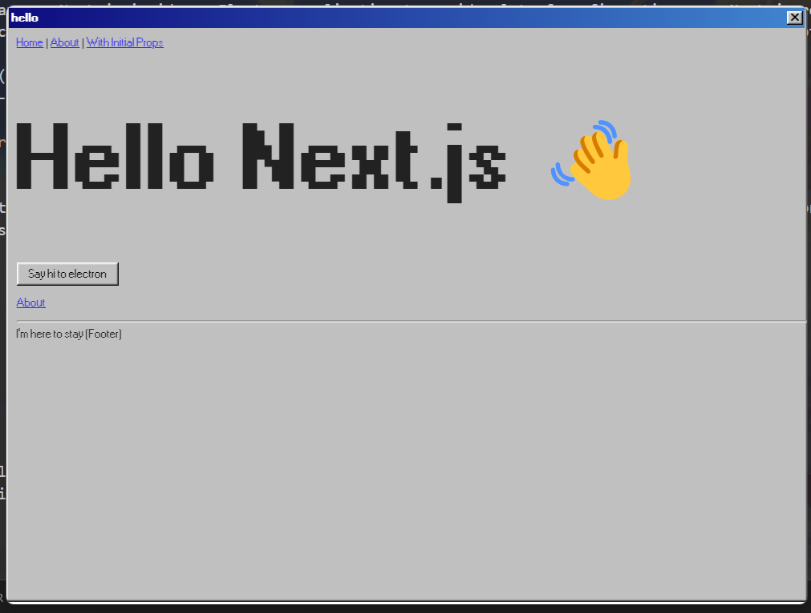

# win98-next-electron



win98-next-electron is a template project based on Electron with Typescript application example with win98.css and support for close button and window dragging.


## Electron with Typescript application example

This example show how you can use Next.js inside an Electron application to avoid a lot of configuration, use Next.js router as view and use server-render to speed up the initial render of the application. Both Next.js and Electron layers are written in TypeScript and compiled to JavaScript during the build process.

| Part       | Source code (Typescript) | Builds (JavaScript) |
| ---------- | ------------------------ | ------------------- |
| Next.js    | `/renderer`              | `/renderer`         |
| Electron   | `/electron-src`          | `/main`             |
| Production |                          | `/dist`             |

For development it's going to run a HTTP server and let Next.js handle routing. In production it use `next export` to pre-generate HTML static files and use them in your app instead of running an HTTP server.

## How to use

Available commands:

```bash
"build-renderer": build and transpile Next.js layer
"build-electron": transpile electron layer
"build": build both layers
"dev": start dev version
"dist": create production electron build
"type-check": check TypeScript in project
```
